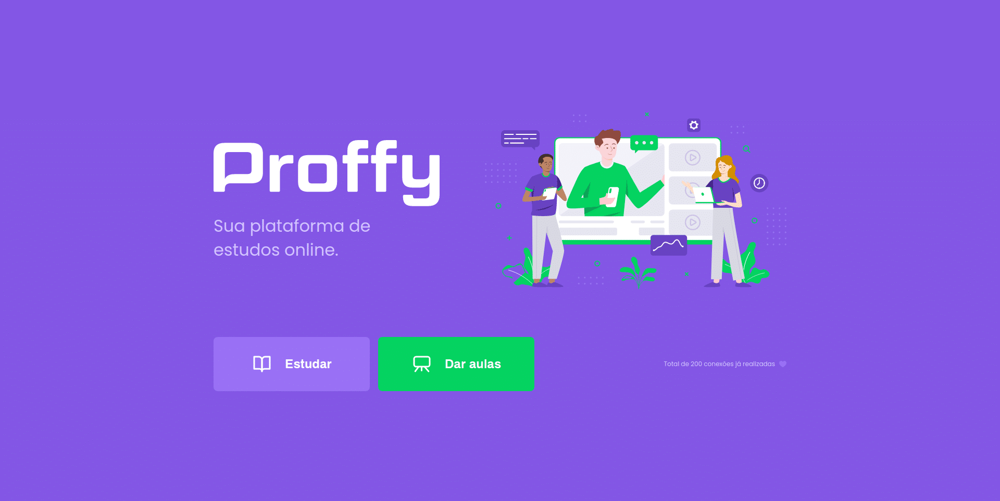

<p align="center">
   <!--  -->
   
</p>
<!-- <h1 align="center">Proffy</h1> -->
<p align="center">
  

  
  
  
  <a href="https://github.com/RamonAlves1357/Proffy_Discovery/blob/master/LICENSE">
    
  </a>
</p>

> Projeto desenvolvido para conectar professores a alunos, realizado na NLW#2 @Rocketseat

---
# 📌 Sumário
* [Preview](#Preview)
* [Sobre](#Sobre)
* [Tecnologias](#Tecnologias)
* [Recursos](#Recursos)
* [Como usar?](#Como_usar)
* [Encontrou um bug? Está faltando algo?](#bug_issues)
* [Licença](#Licença)

---
<a id="Preview"></a>
# 🎬 Preview


---
<a id="Sobre"></a>
# 📖 Sobre
Este é um projeto desenvolvido durante a <b>Next Level Week #2</b>, realizada pela <b>@Rocketseat</b> durante os dias 3 a 9 de Agosto de 2020.

<p>
 A proposta do projeto é uma aplicação que possa ligar quem deseja aprender, com quer ensinar. É possível encontrar alunos para o que você leciona, ou encontrar o professor para aquela matéria que você sempre quis aprender mais! Sem que haja nenhuma limitação de área!!
</p>

---
<a id="Tecnologias"></a>
# 💻 Tecnologias
Este projeto foi realizado usando as seguintes tecnologias:


* [HTML](https://www.w3schools.com/html/)
* [CSS](https://www.w3schools.com/CSS/)
* [JavaScript](https://www.javascript.com/)
* [NodeJS](https://nodejs.org/pt-br/)
* [Nunjuncks](https://mozilla.github.io/nunjucks/)
* [SQLite]()

---
<a id="Recursos"></a>
# 🚀 Recursos
* Site para inscrição de professores e aluno.
<!-- * App para conectar professores e alunos. -->

---
<a id="Como_usar"></a>
# 👷‍♂️ Como usar?

``` sh
  # Clonar o repositorio
  $ git clone https://github.com/RamonAlves/Proffy.git

  # Entre no diretório
  $ cd Proffy
```

---
<a id="bug_issues"></a>
# 🔧 Problemas
Sinta-se a vontade para **registar uma nova edição** com o respectivo titulo e descrição no repositório [Proffy](https://github.com/RamonAlves1357/Proffy_Discovery/issues). Se você já encontrou uma solução para o seu problema, **adoraria analisar sua solicitação de recebimento**!

---
<a id="Licença"></a>
# 📕 Licença
<!-- Lançado em 2020 [📕 License](https://github.com/RamonAlves1357/Proffy_Discovery/blob/master/LICENSE) -->

<p align="center">
  Lançado em 2020 <a href="https://github.com/RamonAlves1357/Proffy_Discovery/blob/master/LICENSE">📕 License</a>
</p>

Feito com <strong style="color:purple">❤</strong>  por [Ramon Alves](https://github.com/RamonAlves1357) juntamente com o Mestre [Mayk Brito](https://github.com/MaykBrito) pela [Rocketseat](https://rocketseat.com.br/) 🚀.
Este projeto está sob a [MIT license](https://github.com/RamonAlves1357/Proffy_Discovery/blob/master/LICENSE).


Dê uma ⭐️ se você curtiu este projeto! 😉